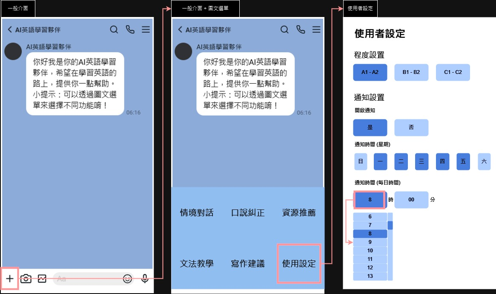

### 分鏡板

##### 說明
- 使用者會從Line進入與AI英語學習夥伴的聊天室，如「一般介面」所示。
- 當使用者點選對應按鈕即可開啟圖文選單，如「一般介面 + 圖文選單」所示。
- 點選圖文選單各個按鈕即可直接切換到對應模式，只有點選「使用設定」時會跳轉至「使用者設定」頁面。
- 「使用者設定」頁面中基本上每個元件都是一般的按鈕(有按下會呈現深色，反之為淺色)，只有最下方的「通知時間(每日時間)」點選時，會在下方出現對應選單，可選取「時」(0 - 23)，以及「分」(00 - 60)。
- 「使用者設定」頁面只要有更動，便會立刻更新使用者的設定；當使用者設定結束直接關閉該頁面即可。
